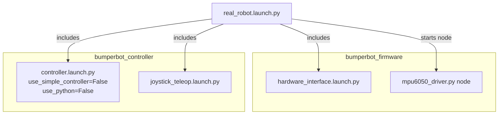

# bumperbot_bringup

The **bringup** package is the top-level entry point for launching the Bumperbot robot. It orchestrates all other packages — wiring together the firmware/hardware interface, motion controllers, and joystick teleoperation into a single command.

## Package Structure

```
bumperbot_bringup/
├── CMakeLists.txt              # CMake build configuration
├── package.xml                 # ROS 2 package manifest
└── launch/
    ├── real_robot.launch.py       # Launch for physical hardware  ← real robot
    └── simulated_robot.launch.py  # Launch for Gazebo            ← sim only
```

## Files

### `launch/real_robot.launch.py` ✅ Real Robot
Brings up the full stack for the **physical robot**:
- **`bumperbot_firmware` → `hardware_interface.launch.py`** — starts the ros2_control hardware interface that talks to the Arduino over serial.
- **`bumperbot_controller` → `controller.launch.py`** — starts the C++ noisy controller (`use_simple_controller=False`, `use_python=False`).
- **`bumperbot_controller` → `joystick_teleop.launch.py`** — joystick teleoperation.
- **`mpu6050_driver.py`** node — reads accelerometer/gyroscope data from the MPU6050 over I2C.

### `launch/simulated_robot.launch.py` 🖥️ Simulation Only
Not used on the real robot. Replaces the hardware interface with Gazebo and sets `use_sim_time: True`.

## Real Robot Launch Flow



## Usage

```bash
# Real robot
ros2 launch bumperbot_bringup real_robot.launch.py

# Simulation only
ros2 launch bumperbot_bringup simulated_robot.launch.py
```
