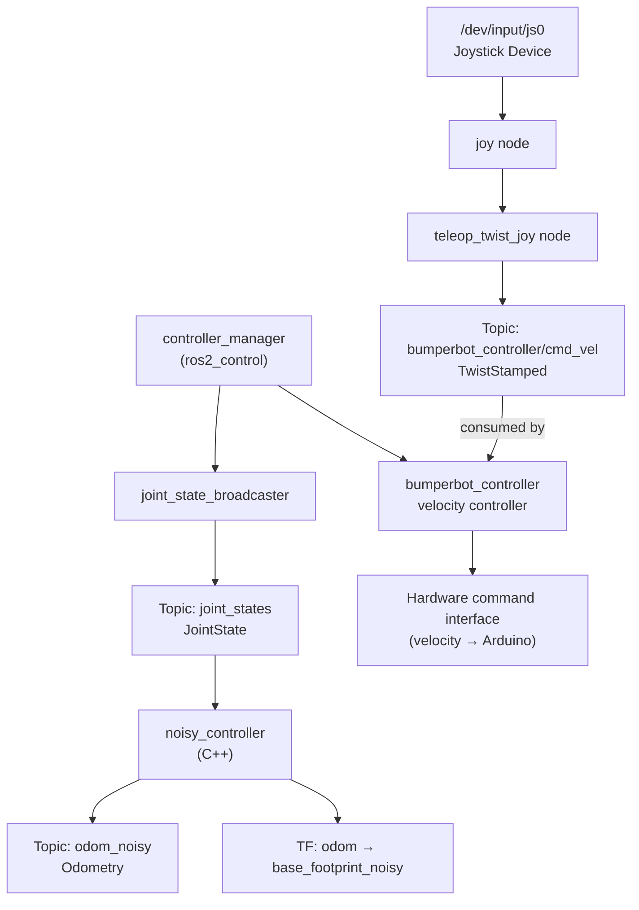

# bumperbot_controller

The **controller** package implements the motion control stack for the Bumperbot. It provides two differential-drive odometry controllers (a clean one and a noise-simulating one) in both Python and C++, along with configuration for ros2_control and joystick teleoperation.

## Package Structure

```
bumperbot_controller/
├── CMakeLists.txt
├── package.xml
├── bumperbot_controller/          # Python nodes (not used on real robot)
│   ├── __init__.py
│   ├── simple_controller.py       # Clean controller  ← sim/tutorial only
│   └── noisy_controller.py        # Noisy controller  ← Python alt, not used on real robot
├── src/                           # C++ nodes
│   ├── simple_controller.cpp      # Clean controller  ← sim/tutorial only
│   └── noisy_controller.cpp       # Noisy controller  ← used on real robot ✅
├── include/bumperbot_controller/  # C++ headers
├── config/
│   ├── bumperbot_controllers.yaml # ros2_control controller definitions
│   ├── joy_config.yaml            # Joystick button/axis mapping
│   └── joy_teleop.yaml            # Teleop velocity scaling
└── launch/
    ├── controller.launch.py       # Main controller launch ✅
    └── joystick_teleop.launch.py  # Joystick teleoperation ✅
```

## Files

### `src/noisy_controller.cpp` ✅ Real Robot
The C++ differential-drive controller used on the real robot (`use_simple_controller=False`, `use_python=False`).
- **Subscribes to:** `joint_states` (JointState) — actual wheel encoder positions from the hardware interface.
- **Publishes to:** `bumperbot_controller/odom_noisy` (Odometry) — odometry with simulated Gaussian encoder noise (σ=0.005 rad), used to test the localization stack.
- Broadcasts the `odom → base_footprint_noisy` TF transform.

### `bumperbot_controller/noisy_controller.py` 🖥️ Python Alternative (not used on real robot)
Same logic as the C++ version but in Python. Selectable via `use_python:=True` launch argument. Not used in the default real-robot bringup.

### `src/simple_controller.cpp` / `bumperbot_controller/simple_controller.py` 🖥️ Simulation / Tutorial Only
A clean version of the differential-drive controller with **no noise**. Used when `use_simple_controller:=True`.
- Publishes clean odometry to `bumperbot_controller/odom`.
- Not used in the real-robot bringup (`use_simple_controller=False`).

### `config/bumperbot_controllers.yaml`
ros2_control YAML defining `joint_state_broadcaster` and `bumperbot_controller` (velocity controller). Specifies wheel joint names and PID parameters. Used by `controller.launch.py`.

### `config/joy_config.yaml` / `config/joy_teleop.yaml`
Configure the joystick device and how joystick axes map to linear/angular velocity commands.

### `launch/controller.launch.py` ✅ Real Robot
Flexible launch file. On the real robot it is called with `use_simple_controller=False` and `use_python=False`, which starts:
1. `joint_state_broadcaster` spawner.
2. `bumperbot_controller` velocity controller spawner.
3. `noisy_controller` (C++) node.

### `launch/joystick_teleop.launch.py` ✅ Real Robot
Starts the `joy` driver node and a teleop twist node that converts joystick input into velocity commands on `bumperbot_controller/cmd_vel`.

## Real Robot Flow



## Usage

```bash
# As called by real_robot.launch.py:
ros2 launch bumperbot_controller controller.launch.py \
  use_simple_controller:=False use_python:=False

ros2 launch bumperbot_controller joystick_teleop.launch.py use_sim_time:=False
```
