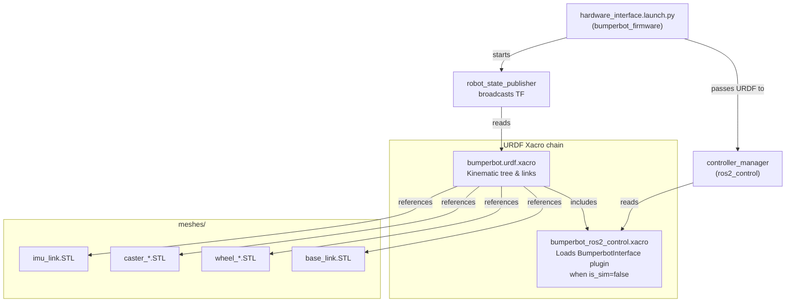

# bumperbot_description

The **description** package contains the robot's physical model — its URDF/Xacro definitions and 3D mesh files. This is the single source of truth for the robot's geometry, inertia, sensor placement, joint structure, and hardware interfaces.

## Package Structure

```
bumperbot_description/
├── CMakeLists.txt
├── package.xml
├── launch/
│   └── gazebo.launch.py                  # 🖥️ Simulation only — spawns robot in Gazebo
├── meshes/                               # 3D STL mesh files (used in URDF visuals)
│   ├── base_link.STL                     # Robot body chassis
│   ├── wheel_left_link.STL               # Left drive wheel
│   ├── wheel_right_link.STL              # Right drive wheel
│   ├── caster_front_link.STL             # Front passive caster
│   ├── caster_rear_link.STL              # Rear passive caster
│   └── imu_link.STL                      # IMU mounting link
└── urdf/
    ├── bumperbot.urdf.xacro              # ✅ Main robot description (root file)
    ├── bumperbot_gazebo.xacro            # 🖥️ Simulation only — Gazebo plugins
    └── bumperbot_ros2_control.xacro      # ✅ ros2_control hardware interface selection
```

## Files

### `urdf/bumperbot.urdf.xacro` ✅ Real Robot
The **root robot description file** — loaded by `controller_manager` on the real robot via `hardware_interface.launch.py`. Defines the full kinematic tree:

| Link | Joint Type | Description |
|---|---|---|
| `base_footprint` | — (virtual root) | Ground-plane reference frame |
| `base_link` | Fixed | Main chassis body |
| `wheel_right_link` | Continuous | Right drive wheel (r=33 mm) |
| `wheel_left_link` | Continuous | Left drive wheel (r=33 mm) |
| `caster_front_link` | Fixed | Front passive caster |
| `caster_rear_link` | Fixed | Rear passive caster |
| `imu_link` | Fixed | MPU6050 IMU placement |

Includes `bumperbot_gazebo.xacro` and `bumperbot_ros2_control.xacro` via `<xacro:include>`.

### `urdf/bumperbot_ros2_control.xacro` ✅ Real Robot
Declares the `<ros2_control>` block. When `is_sim:=false` (real robot), it loads the `BumperbotInterface` serial plugin. When `is_sim:=true`, it loads the Gazebo system plugin instead.

### `urdf/bumperbot_gazebo.xacro` 🖥️ Simulation Only
Adds Gazebo-specific material colours and sensor plugins. Parsed at startup on both real and sim (it's `<xacro:included>`), but its plugins have no effect unless Gazebo is running.

### `meshes/` ✅ Real Robot (visual reference)
Binary STL files used for URDF visual geometry. Collision shapes use simplified primitives (spheres) for better performance.

### `launch/gazebo.launch.py` 🖥️ Simulation Only
Not used by `real_robot.launch.py`. Starts a Gazebo world, launches `robot_state_publisher`, and spawns the robot entity into the simulation.

## Real Robot URDF Loading Flow



## Robot Geometry Summary

- **Wheel radius:** 33 mm  
- **Wheel separation:** ~140 mm (centre to centre)  
- **Drive type:** Differential drive (2 active wheels + 2 passive casters)  
- **IMU:** MPU6050 on `imu_link` above `base_link`
