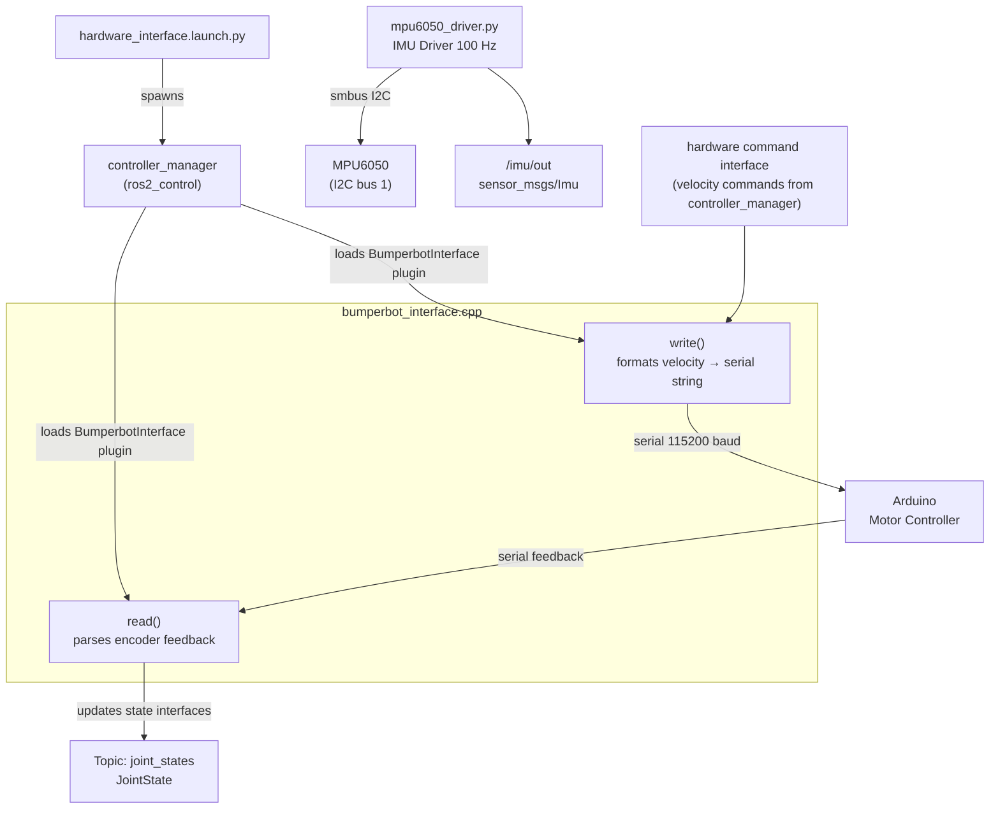

# bumperbot_firmware

The **firmware** package forms the bridge between ROS 2 and the physical hardware. It contains the ros2_control hardware interface plugin (C++) that communicates with the Arduino over serial, and a Python driver for the MPU6050 IMU chip. Both are active on the real robot.

## Package Structure

```
bumperbot_firmware/
├── CMakeLists.txt
├── package.xml
├── bumperbot_interface.xml               # Pluginlib export manifest ✅
├── bumperbot_firmware/                   # Python package
│   ├── __init__.py
│   └── mpu6050_driver.py                 # IMU I2C driver node ✅
├── firmware/
│   └── robot_control/
│       └── robot_control.md              # Arduino firmware documentation
├── include/bumperbot_firmware/
│   └── bumperbot_interface.hpp           # C++ hardware interface header ✅
├── src/
│   └── bumperbot_interface.cpp           # C++ hardware interface implementation ✅
└── launch/
    └── hardware_interface.launch.py      # Starts controller_manager + HW interface ✅
```

## Files

### `src/bumperbot_interface.cpp` / `include/bumperbot_firmware/bumperbot_interface.hpp` ✅ Real Robot
The **ros2_control system hardware interface plugin** (`BumperbotInterface`). This is the critical link between the ROS 2 control stack and the Arduino microcontroller.

- **`on_init()`** — reads the serial port name from URDF hardware parameters.
- **`on_activate()`** — opens the serial port at 115200 baud.
- **`on_deactivate()`** — closes the serial port cleanly.
- **`read()`** — parses comma-separated encoder velocity strings from the Arduino, updating `position_states_` and `velocity_states_` for both wheels.
- **`write()`** — formats velocity commands as a serial string and sends them to the Arduino.

Serial message format:
```
Command → Arduino:   "r<sign><value>,l<sign><value>,"   e.g. "rp12.34,ln05.67,"
Feedback ← Arduino:  "r<sign><value>,l<sign><value>"    e.g. "rp11.20,lp04.90"
```

### `bumperbot_firmware/mpu6050_driver.py` ✅ Real Robot
A Python ROS 2 node that reads the **MPU6050 6-DOF IMU** over I2C at 100 Hz. Started directly from `real_robot.launch.py` as a standalone node.
- Communicates via `smbus` on I2C bus 1 (Raspberry Pi default).
- Converts raw 16-bit accelerometer and gyroscope counts to physical units.
- **Publishes:** `sensor_msgs/Imu` on `/imu/out`.
- Handles I2C disconnections gracefully — auto-reconnects on the next timer tick.

### `firmware/robot_control/robot_control.md`
Documentation for the Arduino firmware (`robot_control.ino`) that runs on the microcontroller. Not a ROS node — describes motor driver wiring, encoder reading, PID, and the serial protocol.

### `bumperbot_interface.xml`
Pluginlib manifest that exports `bumperbot_firmware::BumperbotInterface` as a `hardware_interface::SystemInterface` plugin so ros2_control can discover and load it.

### `launch/hardware_interface.launch.py` ✅ Real Robot
Starts the `controller_manager` node with the robot URDF (`is_sim:=false`) to load the real hardware interface plugin.

## Real Robot Flow



## Usage

```bash
# Start the hardware interface
ros2 launch bumperbot_firmware hardware_interface.launch.py

# Run the IMU driver (started automatically by real_robot.launch.py)
ros2 run bumperbot_firmware mpu6050_driver.py
```
