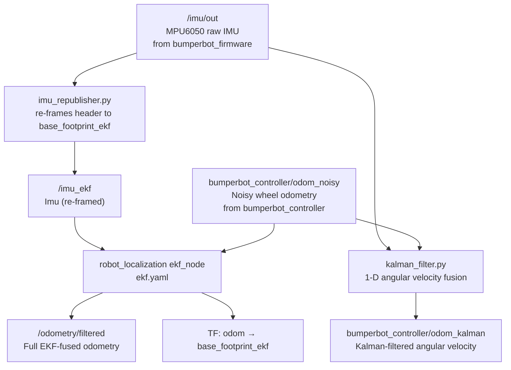

# bumperbot_localization

The **localization** package implements state estimation for the Bumperbot. It fuses noisy wheel-encoder odometry with IMU angular velocity data using a 1-D Kalman filter, and also integrates with `robot_localization`'s Extended Kalman Filter (EKF) for a full-state estimate.

> **Note:** This package is **not launched** by `real_robot.launch.py`. It must be launched separately on top of the base bringup.

## Package Structure

```
bumperbot_localization/
├── CMakeLists.txt
├── package.xml
├── bumperbot_localization/             # Python nodes
│   ├── __init__.py
│   ├── imu_republisher.py             # Remaps IMU topic/frame for EKF ✅
│   └── kalman_filter.py               # 1-D Kalman filter (angular velocity) ✅
├── src/                               # C++ mirrors (alternative, same logic)
│   ├── imu_republisher.cpp            # not used by default launch
│   └── kalman_filter.cpp              # not used by default launch
├── include/bumperbot_localization/    # C++ headers
├── config/
│   └── ekf.yaml                       # robot_localization EKF configuration ✅
└── launch/
    └── local_localization.launch.py   # Starts the full localization stack ✅
```

## Files

### `bumperbot_localization/kalman_filter.py` ✅
A lightweight **1-D Kalman filter** node that fuses wheel-encoder angular velocity with IMU gyroscope angular velocity.

- **Subscribes to:** `bumperbot_controller/odom_noisy` — noisy wheel odometry from `noisy_controller`.
- **Subscribes to:** `imu/out` — raw IMU angular velocity from `mpu6050_driver`.
- **Publishes to:** `bumperbot_controller/odom_kalman` — odometry with filtered angular velocity.

**Algorithm:**
1. **State prediction** — advance the mean by the change in encoder angular velocity; increase variance by `motion_variance_` (4.0).
2. **Measurement update** — blend IMU reading with prediction using `measurement_variance_` (0.5) as the weight.

### `bumperbot_localization/imu_republisher.py` ✅
A thin relay node that re-stamps the IMU message with `base_footprint_ekf` as the frame ID and republishes it for the EKF node.

- **Subscribes to:** `imu/out`
- **Publishes to:** `imu_ekf`

### `src/kalman_filter.cpp` / `src/imu_republisher.cpp`
C++ equivalents of the Python nodes above. Not used by the default `local_localization.launch.py`.

### `config/ekf.yaml` ✅
Configuration for `robot_localization`'s `ekf_node`. Fuses `odom_noisy` and `imu_ekf` into a full state estimate, published as `/odometry/filtered` and the `odom → base_footprint_ekf` TF.

### `launch/local_localization.launch.py` ✅
Starts:
1. The `robot_localization` `ekf_node` using `ekf.yaml`.
2. `imu_republisher` (Python).
3. `kalman_filter` (Python).

## Real Robot Localization Flow



## Usage

```bash
# Start the full localization stack (after real_robot.launch.py is running)
ros2 launch bumperbot_localization local_localization.launch.py
```
